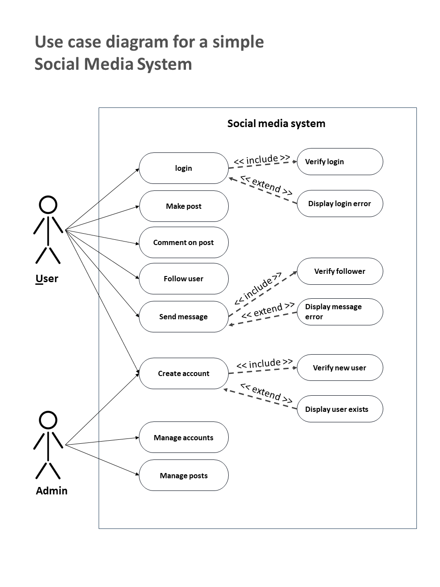
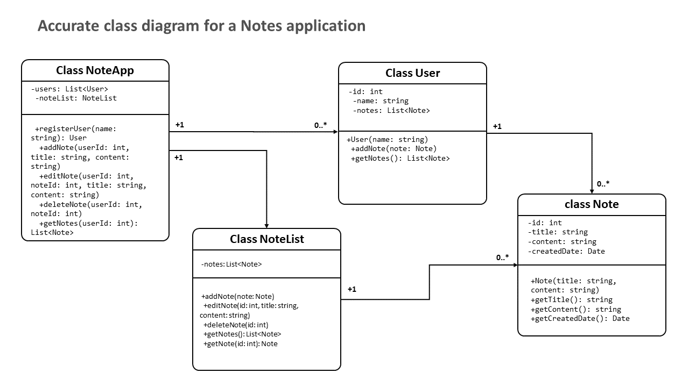

---
jupyter:
  kernelspec:
    display_name: Python 3
    language: python
    name: python3
  language_info:
    codemirror_mode:
      name: ipython
      version: 3
    file_extension: .py
    mimetype: text/x-python
    name: python
    nbconvert_exporter: python
    pygments_lexer: ipython3
    version: 3.11.0
  nbformat: 4
  nbformat_minor: 2
  orig_nbformat: 4
---

<div class="cell markdown">

# Question 1 Answer(s)

Use case diagram for a simple Social Media System

User

-   login
-   Make post
-   Comment on post
-   Follow user
-   Send message

Admin

-   Manage posts
-   Manage accounts
-   Create account
-   Verify login
-   Display login error
-   Verify follower
-   Display message error
-   Verify new user
-   Display user exists

</div>

<div class="cell markdown">



</div>

<div class="cell markdown">

-   
-   
-   
-   
-   

</div>

<div class="cell markdown">

# Question 2 Answer(s)

</div>

<div class="cell markdown">



</div>

<div class="cell markdown">

-   
-   
-   
-   
-   

</div>

<div class="cell markdown">

# Question 3 Answer(s)

</div>

<div class="cell markdown">

#### Below, I implemented the "NotesApp" class with python in the UML above...

</div>

<div class="cell code">

``` python
class NoteApp:

  def __init__(self):
    self.users = []
    self.noteList = NoteList()

  def registerUser(self, name):
    user = User(name)
    self.users.append(user)
    user.id = len(self.users)
    return user

  def addNote(self, userId, title, content):
    user = self.getUser(userId)
    note = Note(title, content)
    self.noteList.addNote(note)
    user.addNote(note)

  def editNote(self, userId, noteId, title, content):
    self.noteList.editNote(noteId, title, content)

  def deleteNote(self, userId, noteId):
    self.noteList.deleteNote(noteId)

  def getNotes(self, userId):
    user = self.getUser(userId)
    return user.getNotes()

  def getUser(self, userId):
    return self.users[userId-1]
```

</div>

<div class="cell markdown">

-   
-   
-   
-   
-   

</div>

<div class="cell markdown">

# Question 4,5,6 Answer(s)

</div>

<div class="cell markdown">

### Here are the steps to design and implement a database for the NoteApp application:

**1. Design database schema:**

``` sql
CREATE TABLE users (
  user_id INT PRIMARY KEY,
  name VARCHAR(100)
);

CREATE TABLE notes (
  note_id INT PRIMARY KEY,
  user_id INT,
  title VARCHAR(100),
  content TEXT,
  created_date DATE,
  FOREIGN KEY (user_id) REFERENCES users(user_id)
);
```

This creates two tables - users and notes with the necessary columns and
relationships. The foreign key establishes the linkage between notes and
users.

**2. Write SQL queries:**

``` sql
-- Get all notes for a user
SELECT * FROM notes WHERE user_id = 123; 

-- Get a specific note 
SELECT * FROM notes WHERE note_id = 456;

-- Get all users
SELECT * FROM users;

-- Create a new note
INSERT INTO notes (user_id, title, content, created_date)
VALUES (123, 'Shopping List', 'Milk, Bread, Apples', '2023-02-28');
```

**3. Implement CRUD operations:**

``` python
# Create
def create_user(name):
  sql = "INSERT INTO users (name) VALUES (%s)"
  cursor.execute(sql, (name,))

def create_note(user_id, title, content):
  sql = "INSERT INTO notes (user_id, title, content, created_date) VALUES (%s, %s, %s, CURDATE())"
  cursor.execute(sql, (user_id, title, content))
  
# Read
def get_user(user_id):
  sql = "SELECT * FROM users WHERE user_id = %s"
  cursor.execute(sql, (user_id,))
  return cursor.fetchone()

def get_notes(user_id):
  sql = "SELECT * FROM notes WHERE user_id = %s"
  cursor.execute(sql, (user_id,))
  return cursor.fetchall()

# Update  
def update_note(note_id, title, content):
  sql = "UPDATE notes SET title = %s, content = %s WHERE note_id = %s"
  cursor.execute(sql, (title, content, note_id))

# Delete
def delete_note(note_id):
  sql = "DELETE FROM notes WHERE note_id = %s"
  cursor.execute(sql, (note_id,))
```

This shows basic CRUD operations to create, read, update and delete data
from the database using SQL and Python.

</div>

<div class="cell markdown">

-   
-   
-   
-   
-   

</div>

<div class="cell markdown">

# Question 7 Answer(s)

### Comparison of REST, SOAP, and GraphQL

**REST (Representational State Transfer)**

-   Uses HTTP methods like GET, POST, PUT, DELETE to manipulate
    resources
-   Typically uses JSON for messaging format
-   Stateless and cacheable
-   Good for public APIs

**SOAP (Simple Object Access Protocol)**

-   Uses XML for messaging format
-   More rigid messaging structure than REST
-   Defines strict schema for requests and responses
-   Good for internal services and enterprise applications

**GraphQL**

-   Developed by Facebook for their data fetching needs
-   Allows clients to define exactly what data they need
-   Uses a schema to define available data and operations
-   Single endpoint, clients post JSON requests
-   Returns JSON responses
-   Good for giving clients flexibility and minimizing over/under
    fetching data

| Type                | REST               | SOAP            | GraphQL               |
|---------------------|--------------------|-----------------|-----------------------|
| Protocol            | HTTP               | XML-RPC         | HTTP                  |
| Messaging Format    | JSON               | XML             | JSON                  |
| Caching             | Yes                | No              | Yes                   |
| Statelessness       | Yes                | Yes             | Yes                   |
| Schema              | No schema          | Strict schema   | Strongly typed schema |
| Server              | Multiple endpoints | Single endpoint | Single endpoint       |
| Batching            | No                 | Yes             | Yes                   |
| Over/under fetching | Yes                | No              | No                    |

</div>

<div class="cell markdown">

-   
-   
-   
-   
-   

</div>

<div class="cell markdown">

# Question 8 Answer(s)

### A graph algorithm to solve an engineering problem

We can model a power grid as a graph, where the nodes represent power
stations and the edges represent transmission lines between stations.
The engineering problem is to find the minimum cost way to connect all
the stations so that power can flow between any two stations.

To solve this, we can use Dijkstra's algorithm to find the shortest
paths between all pairs of nodes. The steps would be:

1.  Model the power grid as a graph with power stations as nodes and
    transmission lines as weighted edges. The edge weights represent the
    cost/distance of building that transmission line.

2.  Run Dijkstra's algorithm starting from each node to find the
    shortest path to every other node. This will give the minimum cost
    way to connect each node.

3.  Combine all the shortest paths between nodes to build the final
    minimum spanning tree that connects the whole grid.

4.  The total weight of all the edges in the spanning tree will be the
    minimum cost to connect the whole grid.

So by modeling the stations and connections as a graph and using
Dijkstra's algorithm, we can efficiently find the optimal way to build
connections between power stations. Here is a Python implementation of
the power grid connectivity problem using Dijkstra's algorithm:

``` python
import heapq

# Model the power grid as a graph
graph = {
    'A': {'B': 5, 'C': 10}, 
    'B': {'A': 5, 'D': 8, 'E': 2},
    'C': {'A': 10, 'E': 5},
    'D': {'B': 8},
    'E': {'B': 2, 'C': 5}
}

# Function to run Dijkstra's algorithm
def dijkstra(graph, start):

    # Distances from start node to other nodes
    distances = {node: float('inf') for node in graph}  
    distances[start] = 0
    
    # Nodes to traverse
    queue = []
    heapq.heappush(queue, [distances[start], start])
    
    while queue:
        
        # Get node with minimum distance
        cur_dist, cur_node = heapq.heappop(queue)
        
        # Update distances of neighbors
        for neighbor, distance in graph[cur_node].items():
            if cur_dist + distance < distances[neighbor]:
                distances[neighbor] = cur_dist + distance
                heapq.heappush(queue, [distances[neighbor], neighbor])
                
    return distances
                
# Run Dijkstra's on each node and combine shortest paths  
shortest_paths = {}
for node in graph:
    distances = dijkstra(graph, node)
    for target, dist in distances.items():
        if target not in shortest_paths or dist < shortest_paths[target]:
            shortest_paths[target] = dist
            
# Print total cost of minimum spanning tree            
print(sum(shortest_paths.values()))
```

This implements Dijkstra's algorithm to find the shortest path from each
node to every other node. We then combine these to get the minimum
spanning tree cost to connect the whole grid.

</div>

<div class="cell markdown">

-   
-   
-   
-   
-   

</div>

<div class="cell markdown">

# Question 9 Answer(s)

[Article on Object Oriented Design](Question_9_OOP_Article.docx)

</div>

<div class="cell markdown">

-   
-   
-   
-   
-   

</div>

<div class="cell markdown">

# Question 10 Answer(s)

[Article on Web APIs](Question_10_Web_API_Article.docx)

</div>
